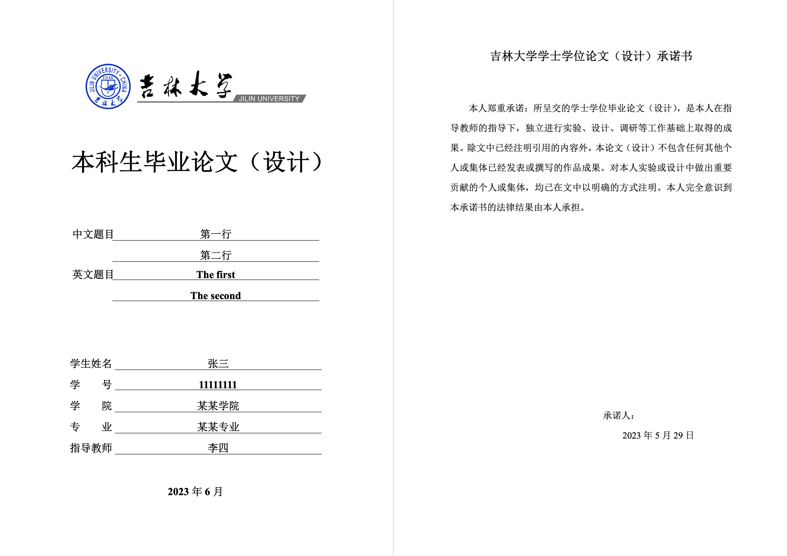
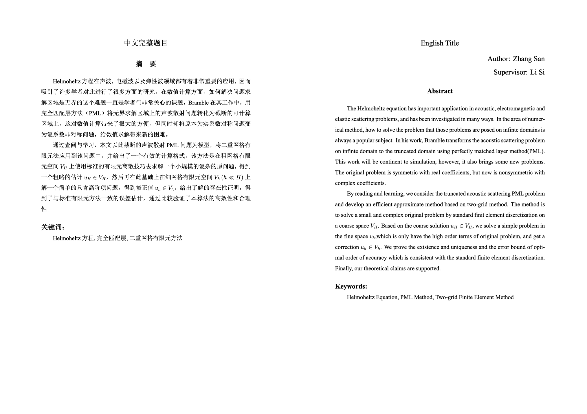
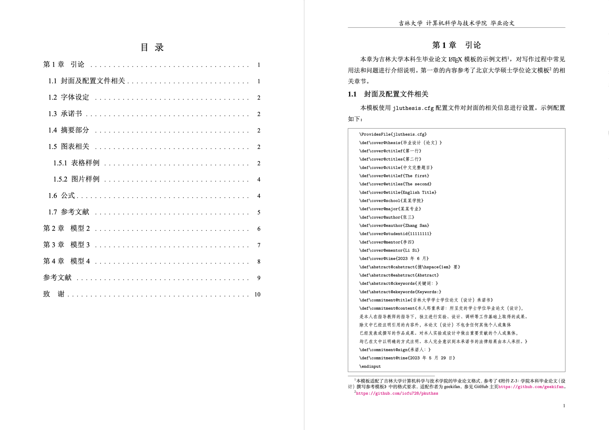

# JLUThesis - 吉林大学LaTeX论文模板

由于教育部于 2023 年提出使用 PDF 作为本科学生毕业论文的上传格式，因此可以直接使用 LaTeX 编写
本科生毕业论文，而不再需要使用 Word 来进行排版。

此项目提供了吉林大学本科生毕业论文的 LaTeX 模板，本模板适配了吉林大学计算机科学
与技术学院的毕业论文格式，参考了《附件 Z-3：学院本科毕业论文（设计）撰写参考模板》中的格式要求。
若您所在学院的模板与此有所不同，请酌情修改 [jluthesis.cls](jluthesis.cls)。
若您发现有任何 bug，请提出 Issue 或提交 Pull Requests。

参考文献使用 `GB/T 7714-2005` 标准进行管理（目前最新标准为 `GB/T 7714-2015`），
具体引用命令与日常使用类似，例如 `\cite{}`。使用本模板之前，请先按照该仓库
[gb7714-2005bibstyle](https://github.com/Haixing-Hu/GBT7714-2005-BibTeX-Style)，
将相关 bibstyle 进行安装，或将其 bst 文件放入项目目录下直接使用。如需切换到最新标准，
请自行查找相关仓库并安装该标准的 bibstyle 文件，
并修改 [reference.tex](data/reference.tex) 中的 `\bibliographystyle` 语句。

## 样例展示

  

  

  

样例 [[图片1](demo/demo1.png)] [[图片2](demo/demo2.png)] [[图片3](demo/demo3.png)] [[PDF](main.pdf)]

## 致谢

本仓库修改自 [Sakura-shem/JLUThesis](https://github.com/Sakura-shem/JLUThesis)，
样例中的部分章节参考了 [北京大学硕士学位论文模板](https://github.com/iofu728/pkuthss})。

## 贡献

- [YuhangQ](https://github.com/YuhangQ)
- [userElaina](https://github.com/userElaina)
- [TechCiel](https://github.com/TechCiel)
- [Magi](https://github.com/Magikaaarp)
- [OneCheck](https://github.com/zwh2119)
- [huacong](https://github.com/huacong)
